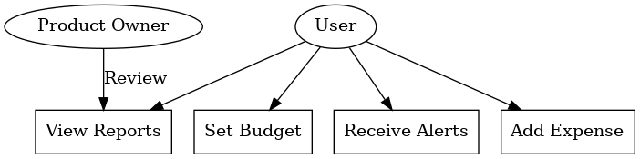

# **Product Feature Analysis Use Case**

## **Title:** *Defining Requirements for a Mobile Banking App's Expense Tracker Feature*

### **1. Introduction**  
With the increasing demand for personal finance management tools, adding an **Expense Tracker Feature** to the mobile banking app aims to enhance customer engagement and financial literacy. This use case outlines the process of defining business and functional requirements to support the development of this feature.

### **2. Business Objectives**  
- Improve customer retention by offering value-added financial management tools.
- Enhance user experience with intuitive expense tracking and insights.
- Support data-driven decision-making for users by visualizing spending patterns.

### **3. Stakeholder Analysis**  
- **Product Owner:** Defines the feature's vision and priorities.
- **Business Analysts:** Gather requirements and ensure alignment with business goals.
- **Developers:** Implement the technical solution based on defined requirements.
- **UX/UI Designers:** Design intuitive user interfaces and experiences.
- **Compliance Team:** Ensure regulatory requirements are met.
- **End Users:** Provide feedback to refine feature functionality.

### **4. Business Requirements (BRD)**  
- **BR1:** The system must allow users to categorize expenses automatically and manually.
- **BR2:** Users should be able to set monthly budgets and receive alerts when nearing limits.
- **BR3:** Provide visual reports (charts, graphs) to analyze spending habits.
- **BR4:** Integrate with existing transaction data for seamless tracking.
- **BR5:** Ensure data privacy and security compliance.

### **5. Functional Requirements (FRD)**  
- **FR1:** Users can add, edit, and delete expense entries.
- **FR2:** The feature supports custom expense categories with icons.
- **FR3:** Budget thresholds trigger in-app notifications.
- **FR4:** Dashboard displays pie charts and bar graphs summarizing expenses.
- **FR5:** Users can export expense reports in PDF and CSV formats.

### **6. Non-Functional Requirements (NFR)**  
- **NFR1:** **Performance:** The system should load expense reports within 2 seconds for up to 1,000 transactions.
- **NFR2:** **Scalability:** The feature must support increasing user activity without performance degradation.
- **NFR3:** **Security:** All user data must be encrypted both at rest and in transit, complying with GDPR and banking security standards.
- **NFR4:** **Usability:** The feature should be intuitive, requiring no more than 5 clicks to access key functionalities.
- **NFR5:** **Reliability:** The system must maintain 99.9% uptime to ensure continuous availability.
- **NFR6:** **Compatibility:** The feature should work seamlessly on both Android and iOS platforms.

### **7. User Stories**  
- *As a user,* I want to categorize my expenses automatically so that I can easily track where my money goes.
- *As a user,* I want to set monthly budgets so that I can control my spending.
- *As a user,* I want to see visual reports of my expenses so that I can analyze my spending habits.

### **8. Use Case Diagram**  

### **9. Assumptions & Constraints**  
- The feature will be integrated into the existing mobile banking app infrastructure.
- Must comply with GDPR and other relevant data privacy regulations.
- Development should be completed within a 3-month sprint cycle.

### **10. Acceptance Criteria**  
- Expense categorization works accurately for 95% of transactions.
- Users receive budget alerts within 5 seconds of crossing thresholds.
- Reports load within 2 seconds for up to 1,000 transactions.
- All user data is encrypted in compliance with security standards.

### **11. Conclusion**  
Defining clear business, functional, and non-functional requirements ensures that the Expense Tracker Feature will meet user needs, enhance the banking app's value proposition, and support the bank's strategic objectives for customer engagement and retention.
